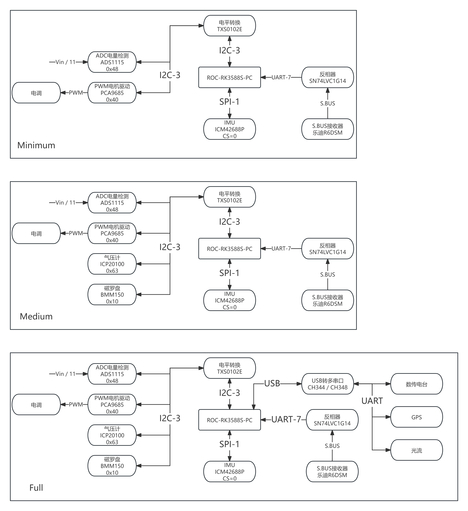

# 硬件
传感器附加板可以基于下图设计

结构图



# 软件
## 1 操作系统修改
下载Firefly RK3588S SDK
```
kernel/arch/arm64/boot/dts/rockchip/roc-rk3588s-pc.dtsi
```
找到spi1，添加下述配置
```
&spi1 {
    pinctrl-names = "default";
    pinctrl-0 = <&spi1m2_cs0 &spi1m2_pins>;
    num-cs = <1>;
    status = "okay";
    spidev1: spidev@0{
            compatible = "rockchip,spidev";
            status = "okay";
            reg = <0x0>;
            spi-max-frequency = <24000000>;
            spi-cpha = <1>;   /* SPI mode: CPHA=1 */
            spi-cpol = <1>;   /* SPI mode: CPOL=1 */
            };
};
```
重新编译设备树或内核或完整系统
## 2 编译PX4
### 2.1 安装交叉编译环境与工具链
```
git clone https://github.com/leeziy/PX4-Autopilot --recursive
git checkout

make clean
make distclean
make submodulesclean

bash PX4-Autopilot/Tools/setup/ubuntu.sh --no-nuttx --no-sim-tools
sudo apt-get install gcc-8-aarch64-linux-gnu g++-8-aarch64-linux-gnu
sudo update-alternatives --install /usr/bin/aarch64-linux-gnu-gcc aarch64-linux-gnu-gcc /usr/bin/aarch64-linux-gnu-gcc-8 100 --slave /usr/bin/aarch64-linux-gnu-g++ aarch64-linux-gnu-g++ /usr/bin/aarch64-linux-gnu-g++-8
sudo update-alternatives --config aarch64-linux-gnu-gcc
```
### 2.2 编译与上传PX4
```
export AUTOPILOT_HOST=hostname
export AUTOPILOT_USER=username
make firefly_rk3588s_arm64
make firefly_rk3588s_arm64 upload
DONT_RUN=1 make px4_sitl_default gazebo-classic
make firefly_rk3588s_x64
make firefly_rk3588s_hitl
```
### 2.3 运行PX4
初次启动
```
cd px4
sudo ./bin/px4 -s rk3588s_mc.config
exit
nano rk3588s_mc.config
注释掉第44行 param reset_all
全系统断电重启
```
正常启动
```
sudo ./bin/px4 -s rk3588s_mc.config //普通启动
sudo taskset -c X-X ./bin/px4 -s rk3588s_mc.config //选择运行核心启动
```
开机自启动
略
## 3 QGroundControl配置与调参
略

# 声明
使用此仓库的工作请注明引用
